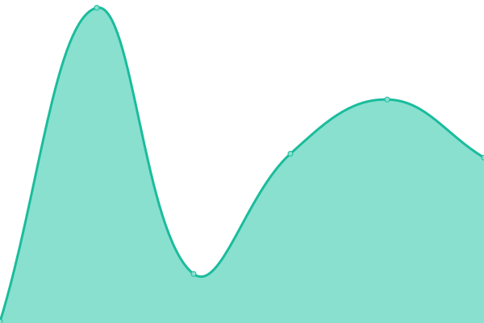

# [📈 Live Status](https://status.ddlc.wiki): <!--live status--> **🟧 Partial outage**

This repository contains the open-source uptime monitor and status page for [MTR-Static](https://status.ddlc.wiki), powered by [Upptime](https://github.com/upptime/upptime).

With [Upptime](https://upptime.js.org), you can get your own unlimited and free uptime monitor and status page, powered entirely by a GitHub repository. We use [Issues](https://github.com/mtr-static-official/status/issues) as incident reports, [Actions](https://github.com/mtr-static-official/status/actions) as uptime monitors, and [Pages](https://status.ddlc.wiki) for the status page.

<!--start: status pages-->
<!-- This summary is generated by Upptime (https://github.com/upptime/upptime) -->
<!-- Do not edit this manually, your changes will be overwritten -->
<!-- prettier-ignore -->
| URL | Status | History | Response Time | Uptime |
| --- | ------ | ------- | ------------- | ------ |
|  [Monika主站](https://monika.love) | 🟩 Up | [monika.yml](https://github.com/mtr-static-official/status/commits/HEAD/history/monika.yml) | 

 1313ms
     
 | 

<a href="https://status.ddlc.wiki/history/monika">96.89%</a>
    

|  [Monika 网盘](https://cloud.monika.love) | 🟩 Up | [monika.yml](https://github.com/mtr-static-official/status/commits/HEAD/history/monika.yml) | 

 1313ms
     
 | 

<a href="https://status.ddlc.wiki/history/monika">96.89%</a>
    

|  [Monika 下载服务](https://dl.monika.love) | 🟩 Up | [monika.yml](https://github.com/mtr-static-official/status/commits/HEAD/history/monika.yml) | 

 1313ms
     
 | 

<a href="https://status.ddlc.wiki/history/monika">96.89%</a>
    

|  [Monika CDN](https://cdn.monika.love) | 🟩 Up | [monika-cdn.yml](https://github.com/mtr-static-official/status/commits/HEAD/history/monika-cdn.yml) | 

 1642ms
     
 | 

<a href="https://status.ddlc.wiki/history/monika-cdn">74.19%</a>
    

|  [Monika 第三方MAS更新源](https://update.mas.monika.love/) | 🟩 Up | [monika-mas.yml](https://github.com/mtr-static-official/status/commits/HEAD/history/monika-mas.yml) | 

 2127ms
     
 | 

<a href="https://status.ddlc.wiki/history/monika-mas">83.98%</a>
    

|  [Monika 论坛](https://forum.monika.love) | 🟩 Up | [monika.yml](https://github.com/mtr-static-official/status/commits/HEAD/history/monika.yml) | 

 1313ms
     
 | 

<a href="https://status.ddlc.wiki/history/monika">96.89%</a>
    

|  [Monika 机房](http://cn-zz1.rvh2.rainyun.com/) | 🟩 Up | [monika.yml](https://github.com/mtr-static-official/status/commits/HEAD/history/monika.yml) | 

 1313ms
     
 | 

<a href="https://status.ddlc.wiki/history/monika">96.89%</a>
    

|  [Monika 网盘（应急访问状态）](http://124.132.136.18/) | 🟩 Up | [monika.yml](https://github.com/mtr-static-official/status/commits/HEAD/history/monika.yml) | 

 1313ms
     
 | 

<a href="https://status.ddlc.wiki/history/monika">96.89%</a>
    

|  [DDLC Wiki](https://wiki.monika.love/) | 🟥 Down | [ddlc-wiki.yml](https://github.com/mtr-static-official/status/commits/HEAD/history/ddlc-wiki.yml) | 

 4106ms
     
 | 

<a href="https://status.ddlc.wiki/history/ddlc-wiki">53.40%</a>
    

|  [Monika 主站-重定向](https://next.monika.love/) | 🟩 Up | [monika.yml](https://github.com/mtr-static-official/status/commits/HEAD/history/monika.yml) | 

 1313ms
     
 | 

<a href="https://status.ddlc.wiki/history/monika">96.89%</a>
    

|  [Doki Doki Mod Manager China Mods Site](https://mods.monika.love/) | 🟥 Down | [doki-doki-mod-manager-china-mods-site.yml](https://github.com/mtr-static-official/status/commits/HEAD/history/doki-doki-mod-manager-china-mods-site.yml) | 

 3092ms
     
 | 

<a href="https://status.ddlc.wiki/history/doki-doki-mod-manager-china-mods-site">52.58%</a>
    

|  [Monika 捐助计划](https://donate.monika.love/) | 🟩 Up | [monika.yml](https://github.com/mtr-static-official/status/commits/HEAD/history/monika.yml) | 

 1313ms
     
 | 

<a href="https://status.ddlc.wiki/history/monika">96.89%</a>
    

|  [Monika Mod Manager China Mods API](https://api.monika.love/mod_store.json) | 🟥 Down | [monika-mod-manager-china-mods-api.yml](https://github.com/mtr-static-official/status/commits/HEAD/history/monika-mod-manager-china-mods-api.yml) | 

 3919ms
     
 | 

<a href="https://status.ddlc.wiki/history/monika-mod-manager-china-mods-api">53.32%</a>
    

|  [Natuski 主站](https://natsuki.love) | 🟩 Up | [natuski.yml](https://github.com/mtr-static-official/status/commits/HEAD/history/natuski.yml) | 

 1678ms
     
 | 

<a href="https://status.ddlc.wiki/history/natuski">99.17%</a>
    

|  [【数据库错误】Yuri 主站](https://yuri.fit/) | 🟩 Up | [yuri.yml](https://github.com/mtr-static-official/status/commits/HEAD/history/yuri.yml) | 

 120ms
     
 | 

<a href="https://status.ddlc.wiki/history/yuri">53.27%</a>
    

|  [Monika OneDrive反代服务](https://onedrive.monika.love/) | 🟩 Up | [monika-one-drive.yml](https://github.com/mtr-static-official/status/commits/HEAD/history/monika-one-drive.yml) | 

 614ms
     
 | 

<a href="https://status.ddlc.wiki/history/monika-one-drive">100.00%</a>
    

|  [Monika 测试论坛](https://test.monika.love/) | 🟩 Up | [monika.yml](https://github.com/mtr-static-official/status/commits/HEAD/history/monika.yml) | 

 1313ms
     
 | 

<a href="https://status.ddlc.wiki/history/monika">96.89%</a>
    

|  [Sayori主站](https://sayori.love/) | 🟩 Up | [sayori.yml](https://github.com/mtr-static-official/status/commits/HEAD/history/sayori.yml) | 

 166ms
     
 | 

<a href="https://status.ddlc.wiki/history/sayori">100.00%</a>
    

|  [DDLCTech 论坛](https://forum.ddlc.tech/) | 🟩 Up | [ddlc-tech.yml](https://github.com/mtr-static-official/status/commits/HEAD/history/ddlc-tech.yml) | 

 912ms
     
 | 

<a href="https://status.ddlc.wiki/history/ddlc-tech">93.88%</a>
    

|  [DDLC 镜像（Coding）](https://mirrors.ddlc.tech/) | 🟩 Up | [ddlc-coding.yml](https://github.com/mtr-static-official/status/commits/HEAD/history/ddlc-coding.yml) | 

 1342ms
     
 | 

<a href="https://status.ddlc.wiki/history/ddlc-coding">100.00%</a>
    

|  [DDLC镜像（Vercel）](https://mirrors.ddlc.wiki/) | 🟩 Up | [ddlc-vercel.yml](https://github.com/mtr-static-official/status/commits/HEAD/history/ddlc-vercel.yml) | 

 164ms
     
 | 

<a href="https://status.ddlc.wiki/history/ddlc-vercel">100.00%</a>
    

|  [【MTR】MTR.PUB OutLook 365](http://autodiscover.mtr.pub) | 🟩 Up | [mtr-mtr-pub-out-look-365.yml](https://github.com/mtr-static-official/status/commits/HEAD/history/mtr-mtr-pub-out-look-365.yml) | 

 3341ms
     
 | 

<a href="https://status.ddlc.wiki/history/mtr-mtr-pub-out-look-365">53.27%</a>
    

|  [DDLC PrivateBin服务](https://s.ddlc.top) | 🟥 Down | [ddlc-private-bin.yml](https://github.com/mtr-static-official/status/commits/HEAD/history/ddlc-private-bin.yml) | 

 2421ms
     
 | 

<a href="https://status.ddlc.wiki/history/ddlc-private-bin">52.51%</a>
    

|  [DDLC 社区图床](https://img.ddlc.top) | 🟥 Down | [ddlc.yml](https://github.com/mtr-static-official/status/commits/HEAD/history/ddlc.yml) | 

 2730ms
     
 | 

<a href="https://status.ddlc.wiki/history/ddlc">47.72%</a>
    

|  [DDLC 中文站（主节点）](https://ddlc.top) | 🟥 Down | [ddlc.yml](https://github.com/mtr-static-official/status/commits/HEAD/history/ddlc.yml) | 

 2730ms
     
 | 

<a href="https://status.ddlc.wiki/history/ddlc">47.72%</a>
    

|  [DDLC 中文站（备用）](https://cn.ddlc.top) | 🟥 Down | [ddlc.yml](https://github.com/mtr-static-official/status/commits/HEAD/history/ddlc.yml) | 

 2730ms
     
 | 

<a href="https://status.ddlc.wiki/history/ddlc">47.72%</a>
    

<!--end: status pages-->

[**Visit our status website →**](https://status.ddlc.wiki)

## 📄 License

- Powered by: [Upptime](https://github.com/upptime/upptime)
- Code: [MIT](./LICENSE) © [MTR-Static](https://status.ddlc.wiki)
- Data in the `./history` directory: [Open Database License](https://opendatacommons.org/licenses/odbl/1-0/)
